# Examples
Please note a lot of these examples are really test reports; they duplicate functionality of other reports but exposed a specific issue that was needed for me to figure out a bug.

The unique reports in this folder are:

| Image | Report Name | Type | Description |
| --- | --- |:----:| --- |
| 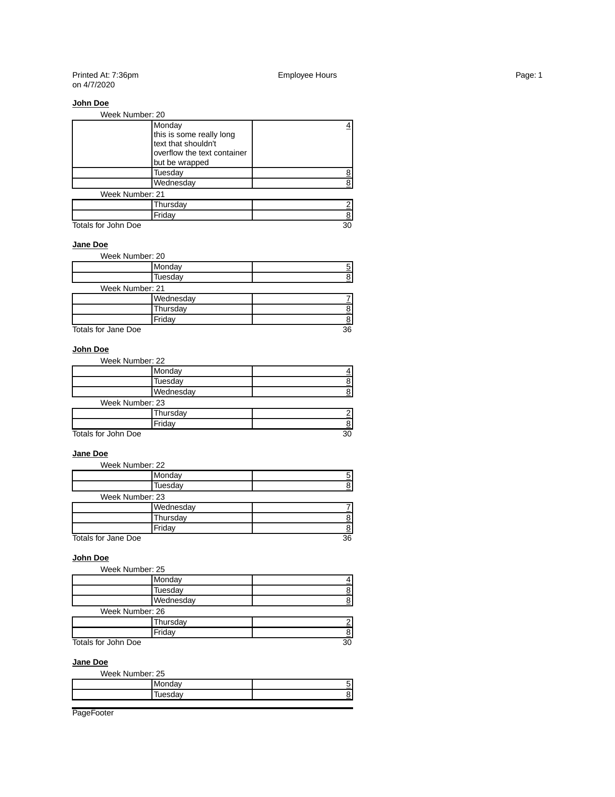 | Demo1 | Code | The Simple Grid report with Grouping |
| 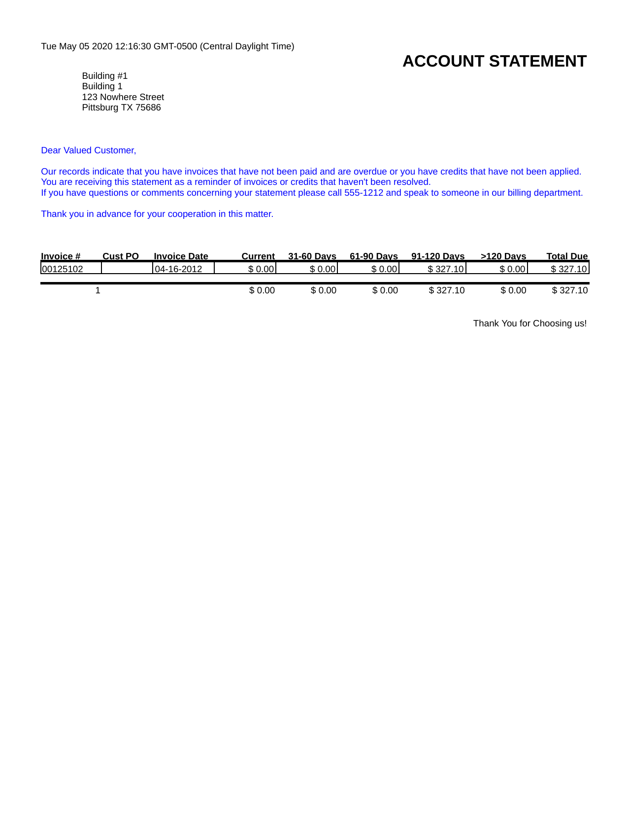 | Demo2 | Code | Account Statement Report |
| 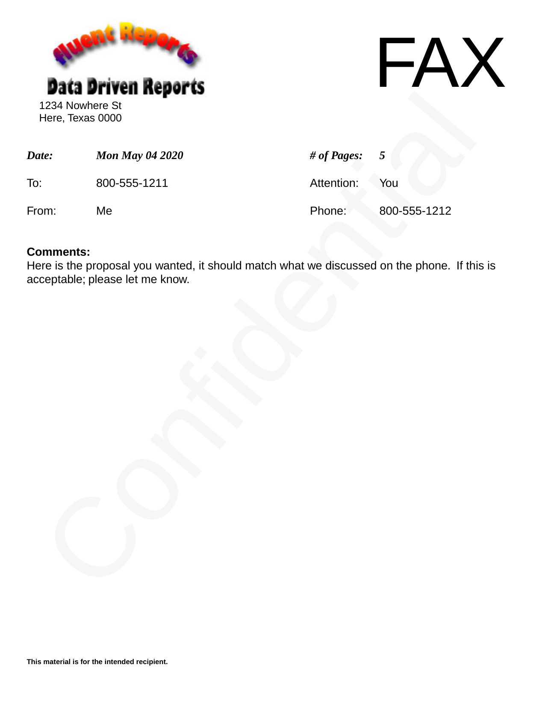 | Demo3 | Code | Fax Cover sheet w/ image |
| 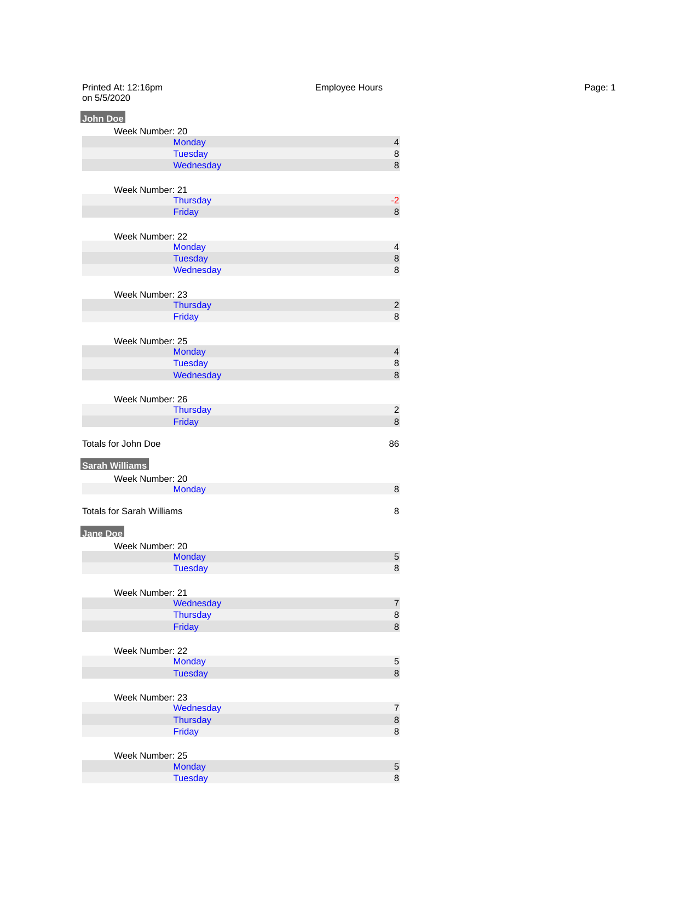 | Demo4 | Code | Same as Demo1 but w/ colors |
| 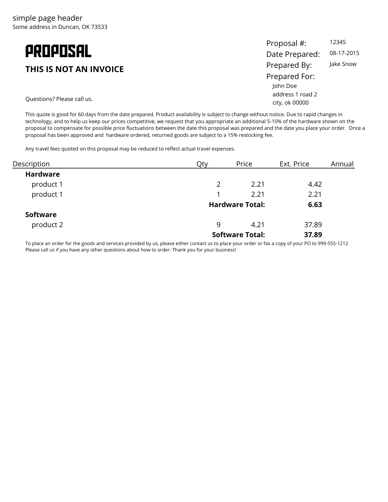 | Demo5 | Code | Proposal Report w/ grouping |
| 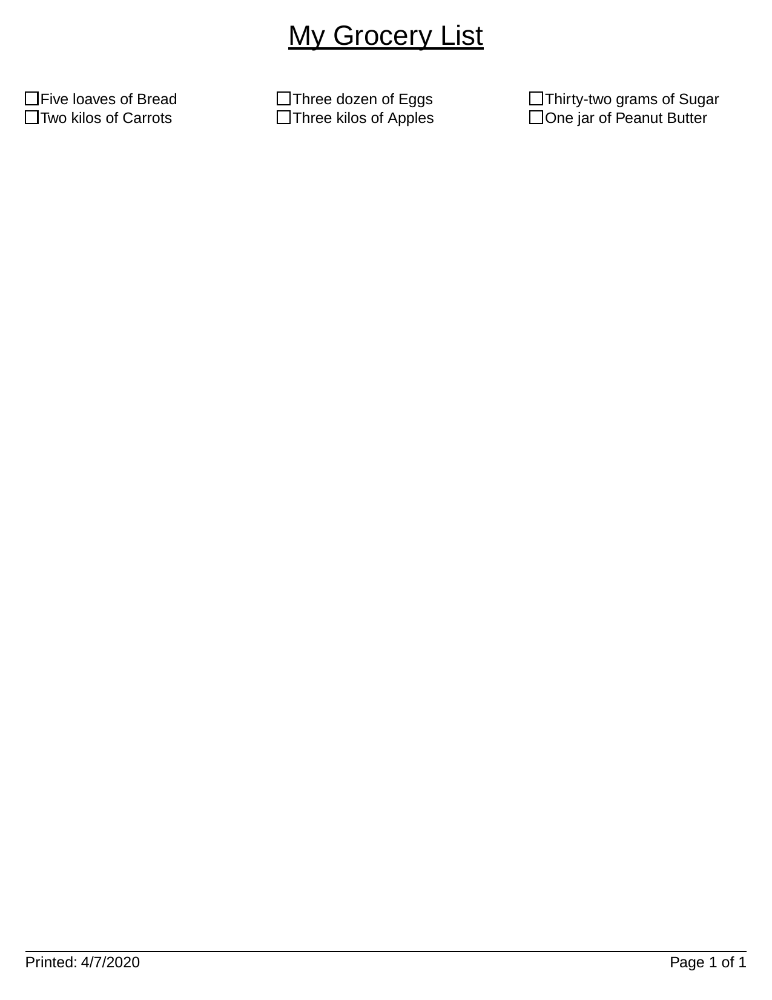 | Demo6 | Code | Tutorial Report w/ 3 columns |
| 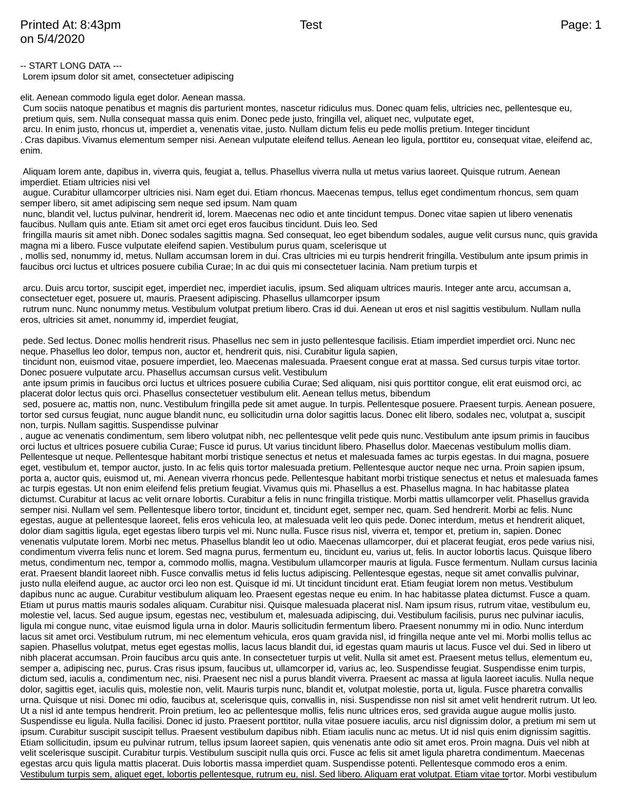 | Demo7 | Code | Just a LOT of continuous text |
|  | Demo9 | Code | Embedding another PDF |
| 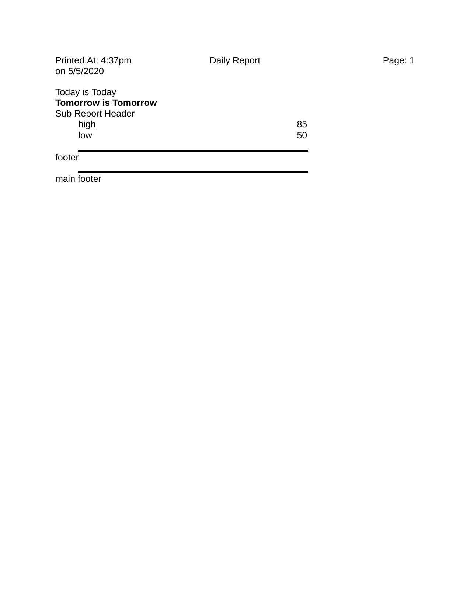 | Demo14 | Code | SubReports |
| 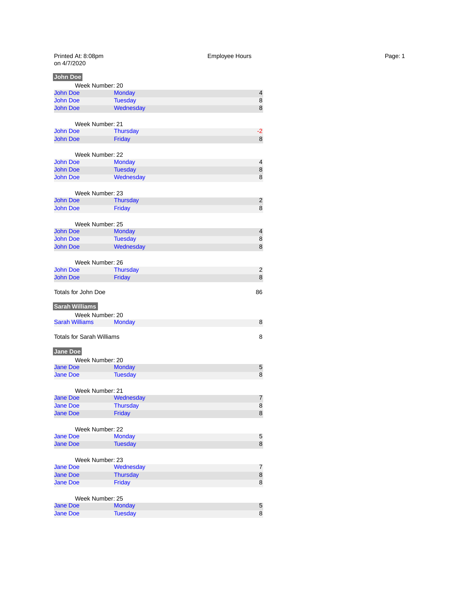 | Demo19 | JSON | JSON Report version of Demo4 |
|  | Demo20 | Code | Opacity, Totals and PIPEs|
| 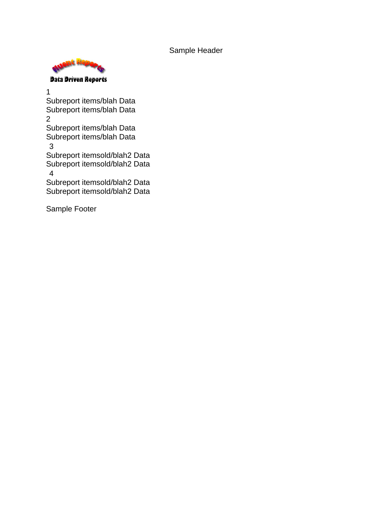 | Demo22 | JSON | JSON Report w/ Image |
| 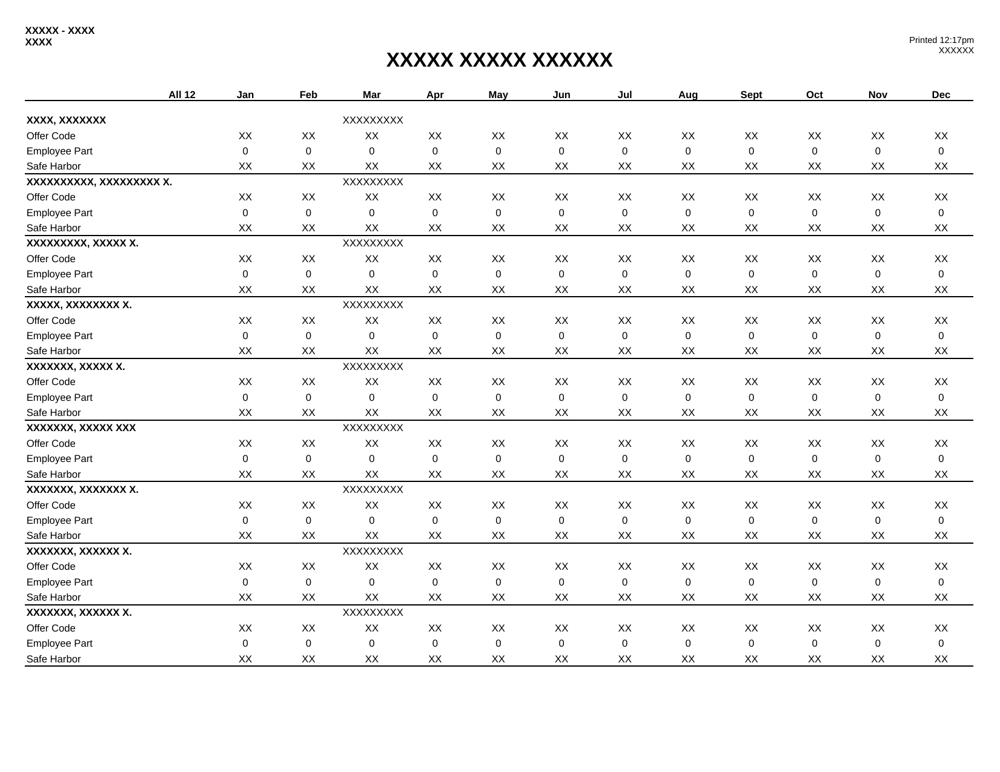 | Demo25 | Code | Complex Spreadsheet report |
|  | Demo26 | Code | Report with custom totaller |
|  | Demo27 | JSON | Multi-level JSON based Report |
| 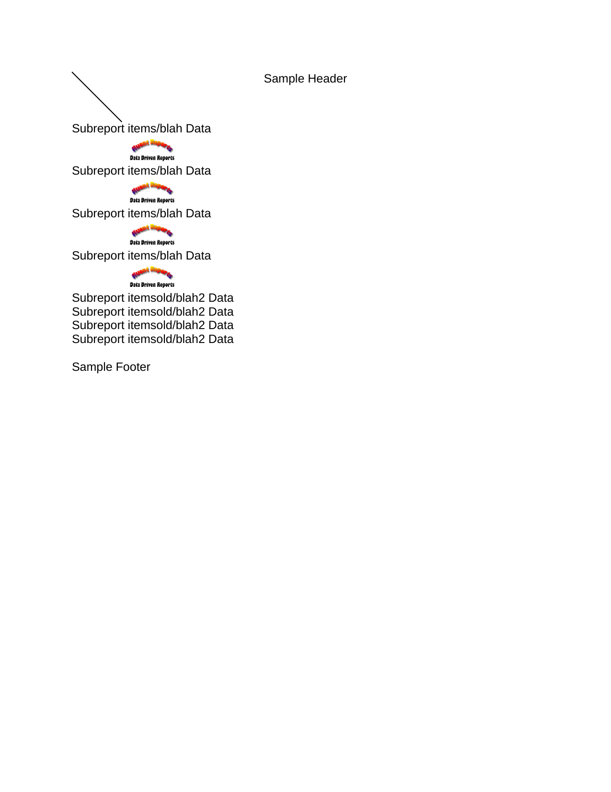 | Demo28 | JSON | JSON Report showing Multiple sub-reports |

Any reports not listed in this list are a duplicate in some way; but may show how to use certain extra functionality.

If you have any ideas for more reports that show off other functionality; please feel free to open an [issue](https://github.com/NathanaelA/fluentreports/issues).
